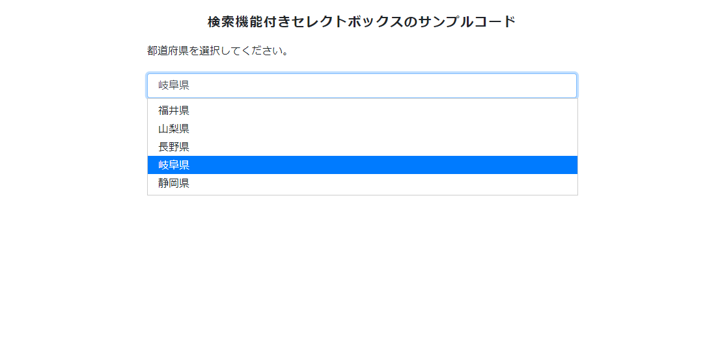

🌙 jquery-searchableSelect
====


## 📗 プロジェクトの概要

検索機能付きセレクトボックスのサンプルコードです。

## 🌐 Demo



https://isystk.github.io/jquery-searchableSelect

## 💬 使い方

各種デーモンを起動する
```
$ npm install
$ npm run dev
```

## 🎨 参考

| プロジェクト                                                                                   | 概要                        |
|:-----------------------------------------------------------------------------------------|:--------------------------|
| [Introduction · Bootstrap v4.6](https://getbootstrap.com/docs/4.6/getting-started/introduction/) | Bootstrap v4.6公式ドキュメントです。 |


## 🎫 Licence

[MIT](https://github.com/isystk/jquery-searchableSelect/blob/master/LICENSE)

## 👀 Author

[isystk](https://github.com/isystk)


